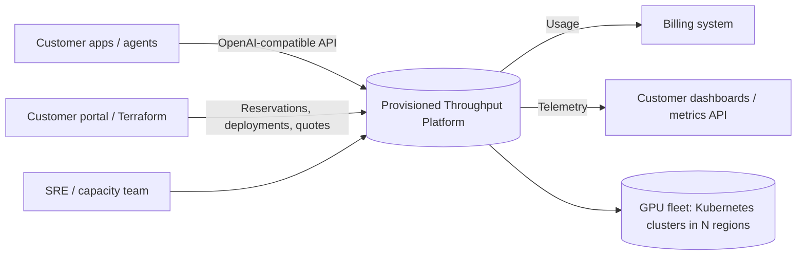
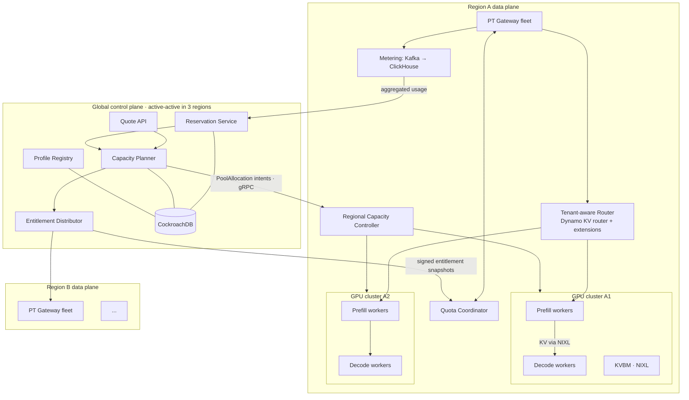
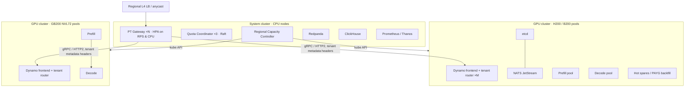
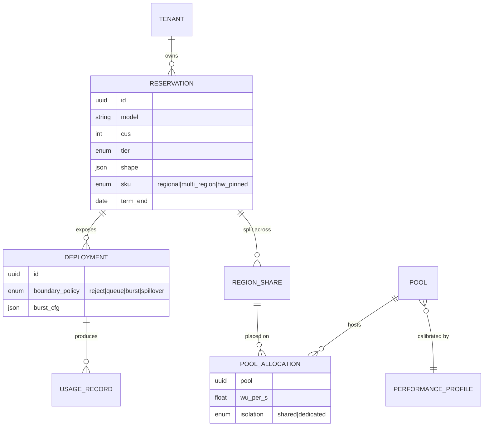

# 03 · System Architecture

## 1. Context

## 2. Two planes

### 2.1 Global control plane

Rust services (tokio + tonic/axum), deployed active-active in three regions on CockroachDB.
The global plane is **off the request path**.

| Component | Responsibility |
|-----------|----------------|
| **Reservation Service** | CRUD for tenants, reservations, deployments, and keys. Enforces terms (1, 3, or 6 months; minimum 1 CU) and increase-only resizes mid-term. Source of truth for entitlements. |
| **Quote API** | Sizing from a shape or trace ([02 §5](02-capacity-unit-and-cost-model.md#5-sizing--quote-api)). Calls the Planner for feasibility. |
| **Capacity Planner** | Sale-time feasibility. Places reservations into regional pools with N+k headroom. Periodic rebalance ([06](06-capacity-planning-and-reliability.md)). |
| **Profile Registry** | Versioned PerformanceProfiles; CU→replica conversion tables. |
| **Entitlement Distributor** | Builds signed, versioned entitlement snapshots per region. Regions pull them with watch and cache them as last-known-good. |
| **Usage Aggregator** | Receives regional hourly aggregates for billing and invoicing. |

### 2.2 Regional data plane

| Component | Tech | Responsibility |
|-----------|------|----------------|
| **PT Gateway** | Rust; Pingora (or hyper + tower) | TLS, auth, tenant/deployment resolution, tokenisation (HF `tokenizers` crate), prefix-block hashing, WU estimation, admission, boundary policy, streaming proxy, usage emission, SLA timestamps |
| **Quota Coordinator** | Rust; tonic; Raft-replicated (openraft) state | Splits each reservation's WU/s across gateway replicas with short leases; settles debt; enforces region share of multi-region entitlements ([ADR-003](adr/ADR-003-lease-based-distributed-quota.md)) |
| **Tenant-aware Router** | Rust crate extending Dynamo's KV router | Priority classes, WFQ by WU, pool placement constraints, pull-based dispatch, KV-overlap scoring ([05 §3](05-isolation-and-scheduling.md#3-level-2--router)) |
| **Dynamo serving graphs** | NVIDIA Dynamo + TRT-LLM / vLLM / SGLang | Disaggregated prefill/decode, KVBM (GPU→CPU→NVMe), NIXL KV transfer, etcd + NATS discovery and KV events |
| **Regional Capacity Controller** | Rust, kube-rs | Reconciles `ModelPool` / `PoolAllocation` CRDs into `DynamoGraphDeployment`s. Owns provisioned floors. Coordinates Dynamo Planner for PAYG. Runs the capacity-aware drain controller. |
| **Metering pipeline** | Redpanda/Kafka → ClickHouse; Rust aggregator | Per-request usage records; per-tenant metrics; hourly aggregates to the global plane |
| **Telemetry API** | Rust (axum) over ClickHouse + Prometheus | Customer-facing per-deployment metrics ([09](09-metering-observability-and-slas.md)) |

## 3. Regional deployment topology

- The **system cluster** is separate from GPU clusters. That way, a GPU cluster upgrade
  never takes admission down.
- The gateway chooses the cluster (pool) from the reservation's `PoolAllocation`. The
  router inside the cluster chooses the worker.
- Traffic stays in-cluster from router to worker. KV transfer runs over RDMA (NIXL) inside
  one NVLink or InfiniBand domain.

## 4. Data model (core entities)

## 5. Key interfaces

| Interface | Protocol | Notes |
|-----------|----------|-------|
| Customer inference | HTTPS, OpenAI-compatible (`/v1/chat/completions`, `/v1/responses`) | Extra headers: `x-pt-deployment`, `x-pt-session-id`, `x-pt-priority` (intra-tenant) |
| Gateway → Router | HTTP/2 or gRPC | Adds `tenant`, `reservation`, `class`, `wu_estimate`, `prefix_hashes`, `deadline` |
| Gateway ↔ Quota Coordinator | gRPC streaming | Lease grant/renew, debt report, entitlement version |
| Global → Region | gRPC (mTLS) | Entitlement snapshots (pull + watch); `PoolAllocation` intents |
| Worker → Metering | NATS → Redpanda bridge | Actual token counts, KV-token-seconds, per-phase timings |

## Blog problems addressed
Structural basis for all problems. The system as a whole is the blog's "build product and engine together" (P20).
