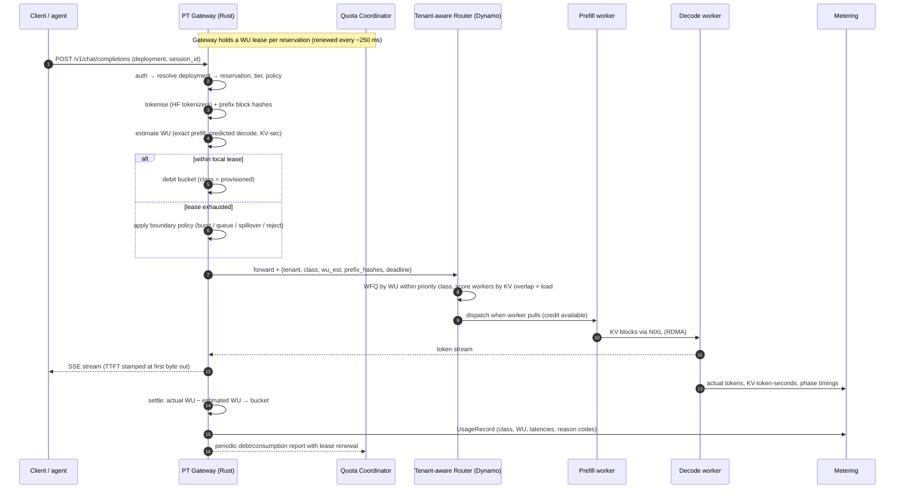

# 04 · Request Lifecycle & Admission Control

> Decision records: [ADR-002](adr/ADR-002-debt-based-wu-bucket.md), [ADR-003](adr/ADR-003-lease-based-distributed-quota.md)

## 1. End-to-end sequence



## 2. Gateway pipeline (hot path)

Built on Pingora (or hyper + tower) as a chain of tower layers. Each stage is
allocation-light and has a latency budget:

| Stage | Budget (p99) | Notes |
|-------|--------------|-------|
| TLS + HTTP parse | amortised | Keep-alive, HTTP/2 |
| Auth + deployment resolve | 50 µs | In-memory map from the entitlement snapshot. API keys hashed with SipHash/BLAKE3 |
| Tokenise | ≤ 1 ms for 32K tokens | HF `tokenizers` crate, per-model tokenizer pool, rayon for > 32K. Longer prompts get a larger budget, which is excluded from N1 |
| Prefix block hashing | 100 µs | Same block size and hash as Dynamo's KV router, so hashes are reusable downstream |
| WU estimate + admit | 20 µs | Lock-free per-reservation atomic bucket |
| Forward | none | Streaming proxy with back-pressure |

## 3. Cost estimation

The blog's central admission problem is that you must price a request before you know
its output length.

- **Prefill: exact.** Tokenisation gives input length. The prefix hashes are checked
  against a gateway-local, approximate **prefix-cache index**: a Bloom filter per pool, fed
  from Dynamo KV events via NATS. That gives an expected `cached_prefill_tokens` value. A
  wrong guess only changes the estimate, and settlement fixes it.
- **Decode: predicted.**
  `decode_est = min(max_tokens, P90_output(tenant, deployment, route_hint))`
  `P90_output` is a streaming quantile sketch (DDSketch) kept per deployment and refreshed
  from settlement. It falls back to the declared shape p95 on cold start.
- **KV-seconds:** `(input + decode_est/2) × decode_est × TPOT_target`.
- **Settlement:** on completion, or on disconnect, `Δ = actual_WU − est_WU` is applied to
  the bucket. The estimation error distribution per deployment is exported. If the
  estimator is biased by more than 10%, an alert fires.

## 4. Boundary policies

Each deployment configures what happens when its bucket is empty:

```yaml
boundary_policy:
  mode: burst            # reject | queue | burst | spillover
  burst:
    accrual: unused      # unused entitlement accrues as burst credit
    max_credit_seconds: 60     # at most 60 s of entitlement banked
    max_rate_multiple: 2.0     # never exceed 2× entitlement instantaneous
  queue:
    max_depth_wu_seconds: 5
    deadline_ms: 2000
  spillover:
    enabled: true
    to: payg              # billed at PAYG list price, class = spillover
  on_exhausted: reject    # after burst/queue/spillover are exhausted
```

| Mode | Behaviour | Class on the wire | Guarantee |
|------|-----------|-------------------|-----------|
| `reject` | HTTP 429, `Retry-After` computed from bucket refill, `x-pt-reason: entitlement_exhausted` | none | Predictable |
| `queue` | Held at the gateway in a deadline-aware queue. Rejected if the deadline would pass | provisioned (queue time counted in TTFT, excluded from SLA) | Latency not guaranteed for queued time |
| `burst` | Draws from banked credit up to the rate multiple | `burst` | Best-effort SLO. Served with priority above PAYG. **No extra charge** within the cap |
| `spillover` | Forwarded to the shared PAYG pool | `spillover` | No SLO. Billed at **PAYG list price** |

The policies chain: `burst → queue → spillover → reject`, in the order the customer
enables them.

## 5. Agentic workloads

The blog notes three agentic traits: bursty, long-context, and repetitive. Each gets a
specific response:

1. **Bursty → burst credit.** Unused entitlement accrues (bounded), so a fan-out of dozens
   of calls after idle time is absorbed without throttling. `burst_factor` in the shape
   declaration sizes the credit limit at sale time. The Planner accounts for correlated
   bursts across tenants with a statistical multiplexing factor ([06 §2](06-capacity-planning-and-reliability.md#2-sizing-formula)).
2. **Repetitive → session affinity plus a cache discount.** `x-pt-session-id` pins a
   session to a worker set (a consistent-hash hint for the router). Combined with KV-aware
   routing, the growing context is a cache hit, so it is charged at coefficient `b`, not `a`.
   Customers see this as a lower WU per call.
3. **Long-context → disaggregated pools.** Long-context reservations are placed on P/D
   disaggregated pools ([05 §5](05-isolation-and-scheduling.md#5-prefilldecode-disaggregation)), with KVBM offload keeping idle-session KV warm in CPU/NVMe between tool calls.
4. **Chain integrity → intra-tenant priority.** `x-pt-priority: continuation` marks
   mid-chain calls. When the bucket is tight, continuation calls draw burst credit first
   and new-session calls are queued or rejected first. A half-finished agent task is worse
   than a delayed new one. At launch, `continuation` is the only intra-tenant priority.
   Customer-defined priority levels (for example, paid vs free users) are not supported.

## 6. Distributed enforcement

A reservation's WU/s must be enforced across many gateway replicas, with no central store
on the hot path ([ADR-003](adr/ADR-003-lease-based-distributed-quota.md)):

- The Quota Coordinator (a 3-node Raft group per region) holds each reservation's region
  share. It grants each gateway a **lease**: a WU/s slice and a burst-credit slice, valid
  for 1 s and renewed every 250 ms.
- Slices are proportional to each gateway's recent demand for that reservation, with a
  small floor so a new request anywhere is admitted promptly.
- Gateways report consumption and debt on renewal. The coordinator rebalances slices.
  Over-admission is bounded by `Σ leases ≤ entitlement`, plus in-flight estimation error,
  which is settled within one lease period. That satisfies N6.
- **Coordinator unavailable:** gateways keep their last lease and decay it linearly to
  50% over 30 s. After that they hold at 50% of `entitlement / gateway_count`. This fails
  safe without a hard outage.
- Low-volume tenants (< 1 gateway's worth of traffic) are routed by consistent hashing to
  2 "home" gateways, so leases don't fragment.

## Blog problems addressed
P7, P8, P11, P12. See [traceability](01-requirements-and-traceability.md#2-traceability-matrix).
