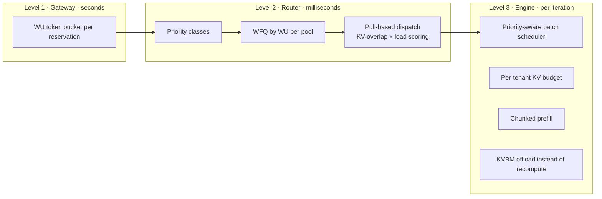

# 05 · Isolation & Scheduling (Noisy Neighbour)

> Decision records: [ADR-004](adr/ADR-004-three-level-fairness.md), [ADR-005](adr/ADR-005-disaggregation-default.md)

## 1. Principle

Continuous batching is what makes inference economical, and it is also the source of
interference. The blog names three mechanisms: long prompts stall decode, long contexts
exhaust KV and force preemption, and bursts fill the batch. We handle isolation as a
**scheduling problem at three timescales** and use hardware separation only where
scheduling cannot do the job.

## 2. Priority classes

| Class | Source | Preemptible by | Notes |
|-------|--------|----------------|-------|
| `provisioned` | Within entitlement | none | Strict priority over everything below |
| `burst` | Banked credit | `provisioned` | Best-effort SLO |
| `spillover` | Over entitlement, customer opted in | `provisioned`, `burst` | PAYG pricing |
| `payg` | On-demand customers, headroom backfill | all above | Funds headroom economics ([ADR-006](adr/ADR-006-headroom-backfill.md)) |

Strict preemption of on-demand traffic by provisioned traffic is, in the blog's words,
"an economic necessity". It is what makes it affordable to backfill idle reserved capacity.

## 3. Level 2 · Router

> **Implementation:** `crates/pt-router`, a scheduling tier in front of the workers
> ([13](13-tenant-aware-routing.md), [ADR-013](adr/ADR-013-tenant-scheduling-tier.md)).
> Dynamo's plugins can take over placement, but not ordering, so ordering stays in the tier.

We extend Dynamo's KV-aware router, a Rust component, with a **tenant scheduler** layer:

- **Per-pool queues** keyed by `(class, tenant)`. Within a class, **Weighted Fair Queuing
  on WU**, not request count. Each tenant's weight is its WU/s allocation on that pool.
  Virtual finish time is `start + wu_est / weight`. A tenant sending 200K-token prompts
  therefore does not get the same share per request as one sending 500-token prompts.
- **Pull-based dispatch:** each worker advertises **credits**: free batch slots plus free
  KV blocks below a high-water mark, published over Dynamo's KV/metrics events. The router
  dispatches only when a worker has credit. Engine-side queues stay shallow (≤ 1 iteration
  of work). As a result, ordering decisions are made in the router, where tenant state is
  known, and not FIFO inside the engine.
- **Worker selection** uses Dynamo's cost function (KV-prefix overlap vs load), restricted
  by the tenant's `PoolAllocation` (dedicated vs shared workers) and session affinity.
- **Tenant KV-share accounting at the router:** the router tracks each tenant's in-flight
  KV blocks per worker. If dispatching would push a tenant over its per-worker KV budget,
  it picks another worker or waits.
- **Starvation guard for PAYG:** PAYG gets a small minimum share (for example, 2%) on
  shared pools, so on-demand customers never starve completely during steady provisioned
  load. That share is carved out of *unsold* capacity only.

## 4. Level 3 · Engine

The engine is the Dynamo backend worker: TRT-LLM, vLLM, or SGLang.

- **Priority passthrough:** the router sets the request priority. vLLM and SGLang support
  priority scheduling. For TRT-LLM we use its request priority and scheduler policy. When
  the engine must preempt (KV pressure), it preempts the lowest class first. Within a
  class, it preempts the tenant most over its KV budget.
- **Per-tenant KV budget:** implemented as a thin **engine adapter patch** that tags KV
  block allocations with the tenant and enforces `budget = pool_kv_blocks × tenant_share ×
  overcommit(1.2)`. Over-budget allocations are allowed only when blocks are free, and they
  are marked preemptible first. We aim to upstream this as a generic "KV quota groups"
  feature.
- **Offload instead of recompute:** preempted sequences have KV offloaded through
  **KVBM** to CPU DRAM or local NVMe, then restored when rescheduled. This avoids the
  blog's "recomputation" penalty. Offload tier time is charged at a discounted `d`.
- **Chunked prefill** on all aggregated workers, with the chunk size tuned per profile, so
  one long prompt cannot freeze batch-mates' streams.

## 5. Prefill/decode disaggregation

Default for pools that serve long-context reservations (declared p95 input > 8K or
context ceiling > 32K):

- Separate **prefill** and **decode** worker pools in the same Dynamo graph. KV moves over
  **NIXL** (RDMA/NVLink).
- A long prefill runs on prefill GPUs and physically cannot stall other tenants' decode
  steps. This eliminates noisy-neighbour mechanism #1 structurally.
- **Conditional disaggregation:** Dynamo decides per request, so short prompts (< ~1K
  uncached tokens) prefill locally on the decode worker. That saves transfer cost.
- Prefill and decode pools are sized independently from the WU components (`a`-weighted
  vs `c`/`d`-weighted demand). Dynamo Planner adjusts the P:D ratio above the provisioned
  floor.
- The prefill pool uses WFQ by *uncached prefill tokens*. The decode pool uses the KV-budget
  scheme.

## 6. Pool tiers (hybrid isolation)

| Tier | Who | Isolation | Utilisation lever |
|------|-----|-----------|-------------------|
| **Shared-provisioned** | Reservations < 1 replica-set of WU/s | Scheduling (L1–L3) | Statistical multiplexing; PAYG backfill |
| **Dedicated / semi-dedicated** | Reservations ≥ 1 replica-set, or compliance needs | Dedicated workers; the router never mixes other *provisioned* tenants in | Idle capacity backfilled with preemptible PAYG. A **strict-dedicated** option with no backfill is offered from launch with a **surcharge of 0.3× the base (Standard) CU price** on top of the tier price: Standard 1.3×, Interactive 1.55×, Agentic 1.8× |
| **PAYG** | On-demand | None beyond fairness | Dynamo Planner autoscaling |
| **Spare** | Hot / warm spares | n/a | Serve PAYG until claimed ([06](06-capacity-planning-and-reliability.md)) |

The threshold (default 1 replica-set) and the backfill ratio are Planner parameters,
tuned per model. The **backfill ratio** is the share of each floor worker's slots and KV
blocks that PAYG and spillover may hold. It defaults to 0.5 (a placeholder), and hot
spares aren't capped. It keeps room on the floor for provisioned work without aborting
PAYG outside a failover ([ADR-026](adr/ADR-026-backfill-ratio.md)).

## 7. Validation: interference test suite

Every release of the router, engine, or profile must pass a mixed-tenant soak on a
staging pool:
- Tenant A: steady in-shape chat at 100% entitlement. Its SLO must hold.
- Tenant B: bursts of 128K-token prompts. Tenant A's TPOT p95 must stay within tier.
- Tenant C: KV-heavy long-lived sessions. A must see no recompute-induced stalls.
- PAYG flood at 3× spare capacity. Provisioned SLO must hold, and PAYG must be preempted
  in < 1 s.

**What's built** ([ADR-025](adr/ADR-025-interference-suite.md)). The staging-pool soak
needs Dynamo workers. Until then, `crates/pt-router/tests/interference.rs` runs the same
scenarios through the real gateway and router against a mock engine that models
continuous batching: step cost grows with the batch, unchunked prefill stalls decode, and
KV overflow evicts and recomputes. Each scenario runs twice. In the *protected* run, A
must meet its tier. In the *control* run, the load goes straight to an engine with no
isolation, and A must miss its tier, which proves the scenario interferes.

| Scenario | Noise | Protection exercised | Protected A (TTFT / TPOT p95) | Control A |
|----------|-------|----------------------|-------------------------------|-----------|
| Long prompts | B: 16K-token prompts (128K scaled to the mock's prefill rate) | B's entitlement at the gateway; chunked prefill | ≈ 130 ms / 10 ms | TPOT ≈ 75 ms |
| KV hog | C: 8K-token sequences held for 300 tokens | Router KV budget (`kv_share` 0.25) | ≈ 190 ms / 12 ms, no recompute | TTFT ≈ 4 s |
| PAYG flood | 3× the pool's slots | Strict priority; pull-based dispatch; backfill ratio | ≈ 65 ms / 16 ms | TPOT ≈ 47 ms |

A runs at 90% of its entitlement rather than 100%, so the gateway never throttles it
and the results measure interference only. The scenarios run for 3 s each in `cargo
test`, and for `PT_SOAK_SECS` (default 60) in the `--ignored` soak. All values are
placeholders until calibration. The mock has one worker and no hot spares, so PAYG
preemption timing is covered by the router's failover tests (docs/13 §2), not here.

## Blog problems addressed
P13, P14, P15, P16, P17. See [traceability](01-requirements-and-traceability.md#2-traceability-matrix).
