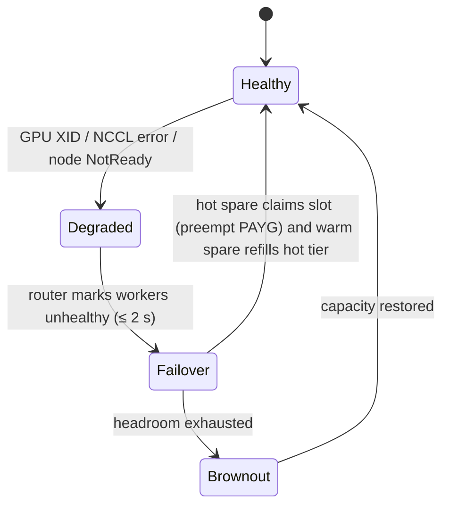

# 06 · Capacity Planning & Reliability (Hidden Headroom)

> Decision record: [ADR-006](adr/ADR-006-headroom-backfill.md)

## 1. What the planner must answer

1. **At sale time:** can we deliver N CUs of model M at tier T in regions R, starting on
   date D? The answer is yes, yes-with-lead-time, or no.
2. **Continuously:** which pools host which reservations, and how many replicas does each
   pool need, including headroom?
3. **During events** (failure, drain, upgrade): is there enough headroom to proceed?

## 2. Sizing formula

For pool *p* (model × GPU class × cluster):

```
demand_wu(p)    = Σ_r  alloc_wu(r, p)                     # sum of reservation allocations on p
burst_wu(p)     = z · sqrt( Σ_r (alloc_wu(r,p) · (burst_factor_r − 1))² )   # correlated-burst allowance, z≈2.3 (99%)
replica_cap(p)  = WU/s-per-replica at tier SLO  (from PerformanceProfile)
N(p)            = ceil( (demand_wu + burst_wu) / (replica_cap · target_util) )
replicas(p)     = N(p) + k(p)
```

- `target_util` (≈ 0.85) leaves room for estimation error and scheduling inefficiency.
- `k(p)` is the **failure-domain headroom**: the maximum number of replicas lost to any
  single failure domain the pool spans (a node, an NVL72 rack, a switch), plus one
  maintenance slot. For pools with ≥ 3 clusters in a region, one cluster loss can also be
  covered for Multi-region SKUs.
- Disaggregated pools are sized separately for the prefill and decode roles.

Placement is **greedy first-fit-decreasing** at sale time, so quotes are fast. A nightly
**MILP rebalance** (good_lp + HiGHS, in Rust) minimises GPUs subject to SLO, isolation,
and residency constraints. It emits migration plans that the Regional Capacity Controller
executes gradually.

## 3. Headroom tiers (and why they're never idle)

| Tier | State | Time to serve provisioned traffic | Meanwhile |
|------|-------|-----------------------------------|-----------|
| **Hot spare** | Model loaded, in the Dynamo graph | < 1 s (preempt PAYG) | Serves PAYG / spillover |
| **Warm spare** | Pod scheduled, weights on node-local NVMe / host RAM, GPU free | < 2 min | GPU can run short preemptible batch jobs |
| **Cold** | Node in the cluster, nothing loaded | < 15 min | Any preemptible use |

The `k(p)` headroom is kept **hot**, because it must absorb failures instantly. The
maintenance slot and burst allowance can be warm. PAYG demand is the economic justification
for hot headroom: it pays for GPUs that provisioned customers need only during failures.

## 4. Fast model loading

Weights reach hundreds of GB, so replacement speed matters:
- **Node-local NVMe weight cache**, pre-populated by a DaemonSet for every model placed in
  that cluster.
- **P2P distribution** from peers (for example, Dragonfly, or GPU-to-GPU transfer using
  NIXL, as Dynamo ModelExpress does where available) instead of pulling from object storage.
- **Streaming loaders** (Run:ai Model Streamer / GPUDirect Storage), and pre-built
  TRT-LLM engines or CUDA graphs cached per profile, so compilation isn't on the critical path.
- Target: warm spare → serving in < 2 min for a 400B-class model on 8×GPU.

## 5. Failure handling



- **Detection:** DCGM exporter plus worker health RPCs. The router stops dispatching
  within 2 s.
- **In-flight requests** on a lost decode worker: if KVBM holds a CPU/NVMe copy, the
  request resumes on another worker. Otherwise it is re-prefilled with priority boost, and
  the settlement credits the tenant for the recompute.
- **Brownout ordering** when headroom is exhausted: shed PAYG → shed spillover → shed burst
  → proportionally reduce provisioned (each reservation keeps an equal fraction of
  entitlement). The event is recorded as an SLA incident.

## 6. Capacity-aware drain controller

A Rust controller that owns the "may I take this capacity away?" decision:
- It intercepts voluntary disruptions: node drain for patching, driver/firmware upgrade,
  and model rollout. It does this through PodDisruptionBudgets, which it computes
  dynamically from pool headroom, plus a `Drain` custom resource workflow.
- **Surge-then-drain:** it brings up a replacement (warm → hot) before cordoning the old
  node. It only proceeds if `replicas − in_flight_drains ≥ N(p) + failure_k(p)`.
- It rate-limits concurrent drains per pool and per failure domain. Security patches get an
  "expedite" path that consumes the maintenance slot and pauses new sales on the pool.

## Blog problems addressed
P9, P10, plus headroom economics for P17. See [traceability](01-requirements-and-traceability.md#2-traceability-matrix).
