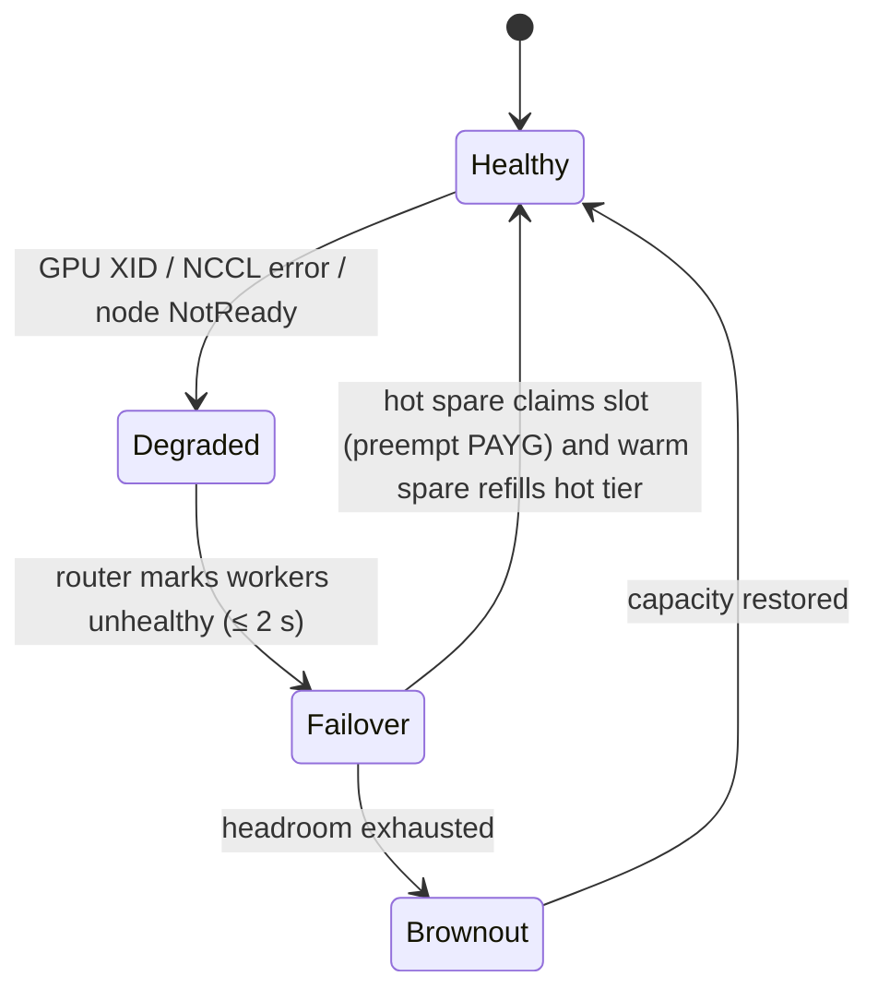

# 06 · Capacity Planning & Reliability (Hidden Headroom)

> Decision records: [ADR-006](adr/ADR-006-headroom-backfill.md), [ADR-031](adr/ADR-031-capacity-in-replicas-per-tier.md), [ADR-033](adr/ADR-033-surge-before-drain.md), [ADR-044](adr/ADR-044-hot-spares-as-router-workers.md), [ADR-045](adr/ADR-045-capacity-placement-across-pools.md)

## 1. What the planner must answer

1. **At sale time:** can we deliver N CUs of model M at tier T in regions R, starting on
   date D? The answer is yes, yes-with-lead-time, or no.
2. **Continuously:** which pools host which reservations, and how many replicas does each
   pool need, including headroom?
3. **During events** (failure, drain, upgrade): is there enough headroom to proceed?

> **Implementation** ([ADR-031](adr/ADR-031-capacity-in-replicas-per-tier.md)): the
> control plane answers (1) against each region's pool of `replicas`. A CU at tier T costs
> `wu_per_cu ÷ (replica_cap(T) · target_util)` replicas, counted in micro-replicas, so
> Agentic, Interactive, and Standard CUs draw what each really needs from the same pool.
> Scheduled arrivals (`[[capacity_changes]]`) count from their date, so a sale that
> doesn't fit now is told the date it would ([ADR-037](adr/ADR-037-planner-lead-times.md)).
> A region can have several pools per model. Each region share is placed on one pool, the
> **best fit** (least free capacity that still fits, ties to configuration order). A share
> that outgrows its pool moves whole to one that fits, and operators move shares between
> pools to migrate hardware ([ADR-045](adr/ADR-045-capacity-placement-across-pools.md)).

## 2. Sizing formula

For pool *p* (model × GPU class × cluster):

```
demand_wu(p)    = Σ_r  alloc_wu(r, p)                     # sum of reservation allocations on p
burst_wu(p)     = z · sqrt( Σ_r (alloc_wu(r,p) · (burst_factor_r − 1))² )   # correlated-burst allowance, z≈2.3 (99%)
replica_cap(p)  = WU/s-per-replica at tier SLO  (from PerformanceProfile)
N(p)            = ceil( (demand_wu + burst_wu) / (replica_cap · target_util) )
replicas(p)     = N(p) + k(p)
```

- `target_util` (0.8, a placeholder, the same value quotes use) leaves room for estimation
  error and scheduling inefficiency.
- `k(p)` is the **failure-domain headroom**: the maximum number of replicas lost to any
  single failure domain the pool spans (a node, an NVL72 rack, a switch), plus one
  maintenance slot. For pools with ≥ 3 clusters in a region, one cluster loss can also be
  covered for Multi-region SKUs.
- Disaggregated pools are sized separately for the prefill and decode roles.

Placement is **greedy best-fit** at sale time, so quotes are fast (built, ADR-045). A nightly
**MILP rebalance** (good_lp + HiGHS, in Rust) minimises GPUs subject to SLO, isolation,
and residency constraints. It emits migration plans that the Regional Capacity Controller
executes gradually.

## 3. Headroom tiers (and why they're never idle)

| Tier | State | Time to serve provisioned traffic | Meanwhile |
|------|-------|-----------------------------------|-----------|
| **Hot spare** | Model loaded, in the Dynamo graph | < 1 s (preempt PAYG) | Serves PAYG / spillover |
| **Warm spare** | Pod scheduled, weights on node-local NVMe / host RAM, GPU free | < 2 min | GPU can run short preemptible batch jobs |
| **Cold** | Node in the cluster, nothing loaded | < 15 min | Any preemptible use |

The `k(p)` headroom is kept **hot**, because it must absorb failures instantly. The
capacity controller labels which Ready pods are hot spares (only pods beyond the floor
plus failure headroom), and routers find them through the pool's spare Service
([ADR-044](adr/ADR-044-hot-spares-as-router-workers.md)). During a region failover, the router reclaims hot spares from PAYG by fencing and then preempting
it ([13 §2](13-tenant-aware-routing.md#2-algorithms), [ADR-015](adr/ADR-015-failover-payg-preemption.md)).
The capacity controller then loads warm spares for any failover demand the hot spares
can't cover, and releases them when the failover ends ([ADR-016](adr/ADR-016-warm-spare-loading.md)). The
maintenance slot and burst allowance can be warm. PAYG demand is the economic justification
for hot headroom: it pays for GPUs that provisioned customers need only during failures.

## 4. Fast model loading

Weights reach hundreds of GB, so replacement speed matters:
- **Node-local NVMe weight cache**, pre-populated by a DaemonSet for every model placed in
  that cluster.
- **P2P distribution** from peers (for example, Dragonfly, or GPU-to-GPU transfer using
  NIXL, as Dynamo ModelExpress does where available) instead of pulling from object storage.
- **Streaming loaders** (Run:ai Model Streamer / GPUDirect Storage), and pre-built
  TRT-LLM engines or CUDA graphs cached per profile, so compilation isn't on the critical path.
- Target: warm spare → serving in < 2 min for a 400B-class model on 8×GPU.

## 5. Failure handling


```mermaid
stateDiagram-v2
  [*] --> Healthy
  Healthy --> Degraded: GPU XID / NCCL error / node NotReady
  Degraded --> Failover: router marks workers unhealthy (≤ 2 s)
  Failover --> Healthy: hot spare claims slot (preempt PAYG) and warm spare refills hot tier
  Failover --> Brownout: headroom exhausted
  Brownout --> Healthy: capacity restored
```

- **Detection:** DCGM exporter plus worker health RPCs. The router stops dispatching
  within 2 s.
- **In-flight requests** on a lost decode worker: if KVBM holds a CPU/NVMe copy, the
  request resumes on another worker. Otherwise it is re-prefilled with priority boost, and
  the settlement credits the tenant for the recompute.
- **Brownout ordering** when headroom is exhausted: shed PAYG → shed spillover → shed burst
  → proportionally reduce provisioned (each reservation keeps an equal fraction of
  entitlement). The event is recorded as an SLA incident.

## 6. Capacity-aware drain controller

A Rust controller that owns the "may I take this capacity away?" decision:
- It intercepts voluntary disruptions: node drain for patching, driver/firmware upgrade,
  and model rollout. It does this through PodDisruptionBudgets, which it computes
  dynamically from pool headroom, plus a `Drain` custom resource workflow.
- **Surge-then-drain:** it brings up a replacement (warm → hot) before cordoning the old
  node. It only proceeds if `replicas − in_flight_drains ≥ N(p) + failure_k(p)`.
- It rate-limits concurrent drains per pool and per failure domain. Security patches get an
  "expedite" path that consumes the maintenance slot and pauses new sales on the pool.

> **Implementation** ([ADR-033](adr/ADR-033-surge-before-drain.md)): no `Drain` resource.
> The controller reacts to cordoned nodes, so `kubectl drain` and managed upgrades work
> unchanged. It adds one replica per pool worker pod on a cordoned node. The budgets stay
> at `floor + failure_k`, so evictions wait for the surge and never use the maintenance
> slots or hot spares. A node annotated `pt.example.com/drain=expedite` gets no surge and
> drains through the maintenance slots. The budget bounds concurrency, so there's no
> separate rate limit. An expedited drain pauses new sales of the pool's model in the
> region through an expiring hold ([ADR-041](adr/ADR-041-sales-holds.md)).

## Blog problems addressed
P9, P10, plus headroom economics for P17. See [traceability](01-requirements-and-traceability.md#2-traceability-matrix).
