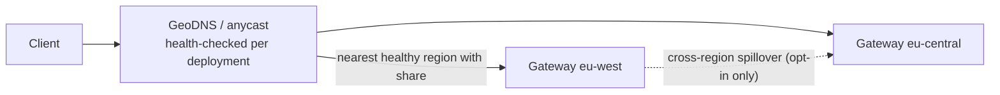

# 07 · Multi-Region Design

> Decision record: [ADR-007](adr/ADR-007-regional-static-stability.md)

## 1. Principles

1. **Regions are independent failure domains.** No request-path dependency crosses a
   region boundary.
2. **Static stability.** If the global control plane is unreachable, every region keeps
   serving on its last-known-good entitlement snapshot for at least 24 h (N4). Only sales,
   resizes, and rebalancing pause.
3. **Data residency by default.** Prompts and completions never leave the serving region
   unless the tenant opts in. Only aggregated, content-free usage flows to the global plane.

## 2. Reservation geography

A reservation has a **region split**:

```yaml
regions:
  - region: eu-west
    share_cus: 60
    home: true
  - region: eu-central
    share_cus: 40
failover:
  sku: multi_region          # regional | multi_region
  pairs: { eu-west: eu-central, eu-central: eu-west }
cross_region_spillover: false
residency: eu                # constrains failover targets
```

| SKU | Normal operation | Region failure |
|-----|------------------|----------------|
| **Regional** | CUs served in the named region(s) | Best effort. Traffic can go to other regions' PAYG/spillover if residency allows. No SLO |
| **Multi-region** | Same | The paired region holds **pre-reserved failover headroom** equal to the failed region's share (hot or warm spares that serve PAYG meanwhile). The SLO applies after the failover window (≤ 5 min) |

## 3. Traffic steering



- Deployment endpoints are regional (`eu-west.pt.example.com`) plus one global name
  (`pt.example.com`) that routes through GeoDNS/anycast to the nearest region holding a
  share for that deployment.
- **Share rebalancing between regions:** with a global endpoint, demand may not match the
  static split. The Entitlement Distributor watches regional utilisation reports every 5 s.
  It shifts up to 20% of a reservation's CUs between its regions (not beyond the region's
  placed capacity) and publishes new snapshots. Settling within tens of seconds is
  acceptable, and the burst bucket absorbs the gap.

## 4. Region failure sequence (Multi-region SKU)

> **Implementation:** operators declare region incidents in the control plane
> (`POST /internal/v1/incidents`). The SLA then excludes the first `failover_window_minutes`
> for Multi-region reservations, and the whole incident in the failed region for Regional
> ones ([09 §5](09-metering-observability-and-slas.md#5-implementation)). Steps 1–3 and 5
> (DNS failover, failover entitlements, headroom claims) aren't built yet.

1. Health checks fail. GeoDNS removes the region (TTL 30 s) and anycast withdraws.
2. The surviving paired region's Quota Coordinator activates the **failover entitlement**,
   which is pre-distributed in the snapshot and dormant until activated.
3. The Regional Capacity Controller claims failover headroom. Hot spares preempt PAYG, and
   warm spares load.
4. SLA clock: the ≤ 5 min failover window is excluded. After that, the SLO applies.
5. Recovery: the region comes back. Shares return gradually (10% per minute) so KV caches
   warm up.

## 5. Global control plane topology

- CockroachDB across 3 regions (for example, one per continent), with
  `REGIONAL BY ROW` tables for tenant data homed near the tenant.
- Rust services are stateless and run in every control-plane region behind a global LB.
- Regions → global communication is outbound-only, over mTLS gRPC. Regions **pull**
  snapshots, which avoids push fan-out failure modes.

## Blog problems addressed
P9 (region-scale reliability), P19 (SLA exclusions), and the multi-region footprint requirement.
