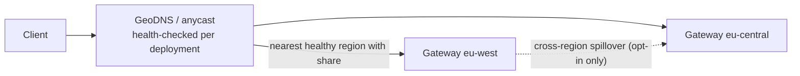
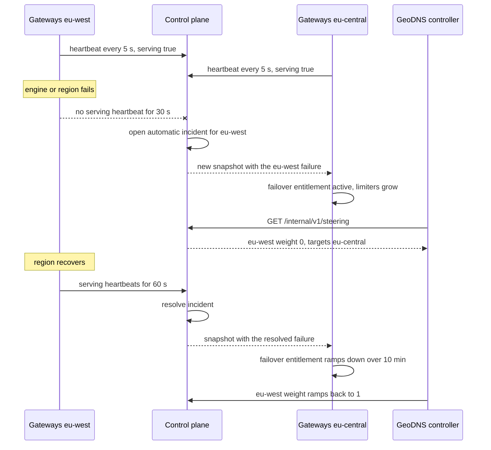

# 07 · Multi-Region Design

> Decision records: [ADR-007](adr/ADR-007-regional-static-stability.md), [ADR-014](adr/ADR-014-automatic-region-failover.md)

## 1. Principles

1. **Regions are independent failure domains.** No request-path dependency crosses a
   region boundary.
2. **Static stability.** If the global control plane is unreachable, every region keeps
   serving on its last-known-good entitlement snapshot for at least 24 h (N4). Only sales,
   resizes, and rebalancing pause.
3. **Data residency by default.** Prompts and completions never leave the serving region
   unless the tenant opts in. Only aggregated, content-free usage flows to the global plane.

## 2. Reservation geography

A reservation has a **region split**:

```yaml
regions:
  - region: eu-west
    share_cus: 60
    home: true
  - region: eu-central
    share_cus: 40
failover:
  sku: multi_region          # regional | multi_region
  pairs: { eu-west: eu-central, eu-central: eu-west }
cross_region_spillover: false
residency: eu                # constrains failover targets
```

| SKU | Normal operation | Region failure |
|-----|------------------|----------------|
| **Regional** | CUs served in the named region(s) | Best effort. Traffic can go to other regions' PAYG/spillover if residency allows. No SLO |
| **Multi-region** | Same | The paired region holds **pre-reserved failover headroom** equal to the failed region's share (hot or warm spares that serve PAYG meanwhile). The SLO applies after the failover window (≤ 5 min) |

**Implementation.** Pairs and residency zones are per region in the control-plane config
(`[[regions]] pair`, `residency`). A reservation's failover target for a region is that
region's `pair` if the reservation has a share there, otherwise its largest other region.
A Multi-region reservation's regions must all be in one residency zone. Its
`failover_headroom` is the largest share that fails over into each region, and the
planner reserves it together with the shares, all or nothing. For example, eu-west 10 and
eu-central 4 hold 14 CUs in each region. Headroom isn't billed separately yet (see
[11 §4](11-roadmap-risks-open-questions.md#4-product-decisions)).

## 3. Traffic steering



- Deployment endpoints are regional (`eu-west.pt.example.com`) plus one global name
  (`pt.example.com`) that routes through GeoDNS/anycast to the nearest region holding a
  share for that deployment.
- **Share rebalancing between regions:** with a global endpoint, demand may not match the
  static split. The Entitlement Distributor watches regional utilisation reports every 5 s.
  It shifts up to 20% of a reservation's CUs between its regions (not beyond the region's
  placed capacity) and publishes new snapshots. Settling within tens of seconds is
  acceptable, and the burst bucket absorbs the gap.

## 4. Region failure sequence (Multi-region SKU)



1. **Detect.** Every gateway heartbeats to the control plane
   (`POST /internal/v1/heartbeats`, region token) every 5 s. It reports `serving` only if
   it has entitlements and its engine answers `engine_health_path`. A region is down when
   no gateway has reported serving for `heartbeat_timeout_seconds` (30). The control plane
   then opens an `automatic` incident, starting at the last serving heartbeat. It never
   declares one unless another region is serving: if every region looks down, the control
   plane is the one cut off. Regions that haven't reported since a control-plane restart
   are `unknown` and never declared.
2. **Steer.** `GET /internal/v1/steering` (operator key) gives each region's weight (0
   while an incident is open) and each reservation's target weights. A Multi-region
   reservation's failed share moves to its failover target. A Regional one keeps only its
   healthy regions' shares, with no failover entitlement (best effort). A GeoDNS or global
   load-balancer controller publishes these weights, with a 30 s TTL.
3. **Activate.** Snapshots already carry each reservation's dormant failover shares.
   Opening the incident bumps the snapshot version, and the new snapshots list the
   failure. Each gateway in the target region raises the reservation's entitlement to its
   own CUs plus the failover CUs. The Quota Coordinator shares the larger entitlement
   between replicas as usual.
4. **Claim headroom.** The headroom is already reserved (§2). *Not built:* the Regional
   Capacity Controller preempting PAYG on hot spares and loading warm spares when an
   incident opens.
5. **SLA.** The first `failover_window_minutes` (5) of the incident are excluded for
   Multi-region reservations. The whole incident is excluded in the failed region for
   Regional ones ([09 §5](09-metering-observability-and-slas.md#5-implementation)).
6. **Recover.** Once the region has served continuously for `recovery_seconds` (60), the
   control plane resolves the automatic incident. Over `return_ramp_minutes` (10, so 10%
   per minute) the failover entitlement ramps down and the region's DNS weight ramps back
   up, so KV caches warm up. Gateways compute the ramp from the timestamps in the
   snapshot, so it needs no further snapshots. Operator-declared incidents are resolved
   only by operators.

**Limits**
- Activation needs the control plane. If it's unreachable during a region failure,
  gateways keep serving their last snapshot, but failover doesn't activate.
- A partition between a healthy region and the control plane looks like a failure. The
  region keeps serving while its pair activates failover, so the reservation briefly
  over-serves. It never under-serves.
- The steering feed is an API, not a DNS integration. Anycast withdrawal and the DNS
  controller are deployment work.

## 5. Global control plane topology

- CockroachDB across 3 regions (for example, one per continent), with
  `REGIONAL BY ROW` tables for tenant data homed near the tenant.
- Rust services are stateless and run in every control-plane region behind a global LB.
- Regions → global communication is outbound-only, over mTLS gRPC. Regions **pull**
  snapshots, which avoids push fan-out failure modes.

## Blog problems addressed
P9 (region-scale reliability: detection, failover, headroom), P19 (SLA exclusions), and the multi-region footprint requirement.
