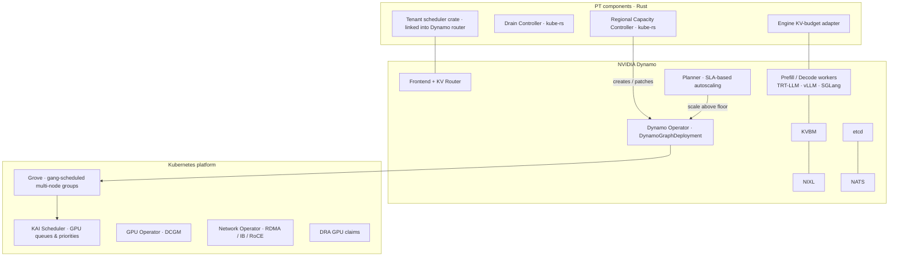

# 08 · Kubernetes & NVIDIA Dynamo Integration

> Decision records: [ADR-008](adr/ADR-008-dynamo-substrate.md), [ADR-009](adr/ADR-009-rust.md)

## 1. Stack per GPU cluster



## 2. Custom resources

All CRDs are defined in Rust with `kube-rs` `#[derive(CustomResource)]`, and the schemas
are generated from the same types the controllers use.

### `PerformanceProfile` (cluster-scoped, produced by Calibration Service)
```yaml
apiVersion: pt.example.com/v1
kind: PerformanceProfile
metadata: { name: llama-4-maverick.b200.trtllm-1.2.tp8 }
spec:
  model: llama-4-maverick
  gpuClass: B200
  engine: { backend: trtllm, version: "1.2" }
  parallelism: { tp: 8, pp: 1, ep: 1 }
  coefficients: { a: 1.00, b: 0.08, c: 3.10, d: 0.00021 }
  decodeModifiers: { specDecode: 0.62, jsonSchema: 1.07 }
  capacity:           # WU/s per replica at tier SLO
    interactive: 41000
    agentic: 35500
    standard: 58000
status: { validatedAt: "2026-09-20T00:00:00Z", driftPct: 1.4 }
```

### `ModelPool` (namespaced per model)
```yaml
apiVersion: pt.example.com/v1
kind: ModelPool
metadata: { name: maverick-b200-a1 }
spec:
  model: llama-4-maverick
  profileRef: llama-4-maverick.b200.trtllm-1.2.tp8
  isolation: shared                 # shared | dedicated
  disaggregation: { enabled: true, conditional: true, prefillReplicasMin: 4, decodeReplicasMin: 10 }
  headroom: { failureDomainK: 2, maintenanceSlots: 1, hotSpares: 2, warmSpares: 2 }
  payg: { backfill: true, maxReplicas: 40 }
status:
  provisionedFloor: { prefill: 6, decode: 14 }
  allocatedWuPerSec: 512000
  capacityWuPerSec: 612000
```
The controller renders a `ModelPool` into a **`DynamoGraphDeployment`**: frontend, router
with the tenant scheduler enabled, and prefill/decode worker services with resource claims.
It then sets **minimum replicas = provisioned floor + k**.

### `PoolAllocation` (reservation share on a pool)
```yaml
apiVersion: pt.example.com/v1
kind: PoolAllocation
metadata: { name: res-7f3a.maverick-b200-a1 }
spec:
  reservation: res-7f3a
  tenant: acme
  pool: maverick-b200-a1
  wuPerSec: 82000
  tier: agentic
  kvShare: 0.16
  dedicatedWorkers: []            # populated for dedicated isolation
```
The router watches `PoolAllocation`s (through a small projection it reads from etcd), which
gives it WFQ weights and KV budgets without calling the Kubernetes API on the hot path.

### `CapacityReservation` (regional mirror of the global contract, read-only in-cluster)
Carries tier, shape, and boundary policy for audit and for controllers. The global plane
remains the source of truth.

## 3. Division of responsibility with Dynamo

| Concern | Dynamo provides | PT adds |
|---------|-----------------|---------|
| Request routing | KV-aware router (prefix overlap × load) | Tenant priority classes, WFQ by WU, KV-share accounting, pull-based credits, placement filters |
| Disaggregation | Prefill/decode workers, conditional disagg, NIXL transfer | Per-reservation choice of disagg pools; WU weights per phase |
| KV management | KVBM multi-tier offload, KV events | Tenant-tagged KV budgets (engine adapter); offload-instead-of-recompute policy |
| Autoscaling | Planner (SLA-driven, load-predictive) | **Floor ownership**. Planner may scale only above `provisionedFloor + k`, and only for PAYG demand |
| Deployment | Operator, `DynamoGraphDeployment`, Grove | `ModelPool` → DGD rendering; drain gating |
| Discovery | etcd + NATS | Tenant allocation projection published into the same etcd namespace |

**Integration approach:** the tenant scheduler is a Rust crate implemented behind a trait
at Dynamo's router selection/queueing boundary. We maintain a thin fork until an upstream
plugin interface exists, and rebase every Dynamo minor release. Engine KV-budget changes
live in a backend adapter and are proposed upstream. Upstream churn is a key risk
([11](11-roadmap-risks-open-questions.md#3-risks)).

## 4. Scheduling & GPU resources

- **KAI Scheduler** queues: `pt-provisioned` (non-preemptible, guaranteed quota = floor),
  `pt-spares` (guaranteed quota = k), `payg` (over-quota, preemptible). Gang scheduling
  keeps multi-node TP/PP groups atomic.
- **Grove** expresses multi-node prefill/decode groups (PodCliqueSets) and their
  startup ordering.
- **Topology awareness:** decode and prefill groups for the same pool are placed inside
  the same NVLink/IB domain, so NIXL transfers stay on the fast fabric. Failure-domain
  labels feed `k(p)`.
- **DRA** for GPU claims (and MIG profiles for small models on shared-provisioned pools).

## 5. Fleet management

- **Cluster API** provisions GPU clusters. **Argo CD** (app-of-apps) deploys the platform
  stack per cluster from Git.
- Controllers and CRDs are versioned together. The Regional Capacity Controller refuses to
  reconcile a `ModelPool` whose profile's engine version doesn't match the deployed image.
- The global plane talks to regional controllers over gRPC, not through a federated
  Kubernetes API. This keeps the blast radius regional ([ADR-007](adr/ADR-007-regional-static-stability.md)).

## 6. Alternatives considered

- **Kubernetes Gateway API Inference Extension (endpoint picker):** good for model-aware
  routing, but tenant WU accounting and KV-share scheduling need tight coupling with
  Dynamo's KV router state. We may still use Gateway API for north-south ingress in front
  of the PT Gateway.
- **KServe / llm-d:** see [ADR-008](adr/ADR-008-dynamo-substrate.md).

## Blog problems addressed
P13–P17 (mechanisms), P20 (product constructs as first-class infrastructure objects).
