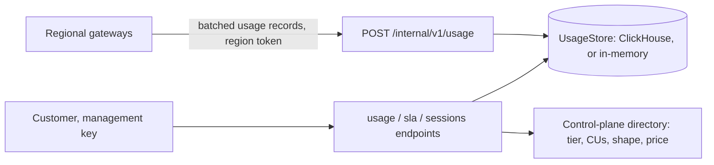

# 09 · Metering, Observability & SLAs

> Decision record: [ADR-010](adr/ADR-010-sla-at-gateway.md)

## 1. Usage record

The gateway emits one record per request after settlement. Workers contribute actual
counts via NATS.

```rust
pub struct UsageRecord {
    pub request_id: Uuid,              // idempotency key
    pub tenant: TenantId,
    pub reservation: ReservationId,
    pub deployment: DeploymentId,
    pub region: Region,
    pub pool: PoolId,
    pub class: TrafficClass,           // Provisioned | Burst | Spillover | Payg
    pub session_id: Option<String>,
    pub tokens: TokenBreakdown,        // uncached_prefill, cached_prefill, decode
    pub kv_token_seconds: f64,
    pub wu_estimated: f64,
    pub wu_actual: f64,
    pub timings: Timings,              // gateway_in, admitted, first_byte_out, last_byte_out, queue_ms
    pub in_shape: bool,
    pub outcome: Outcome,              // Ok | Rejected(Reason) | ClientCancelled | Error(Code)
    pub profile_version: String,
}
```

**Pipeline:** gateway → Redpanda (acks=all, idempotent producer) → ClickHouse
(`ReplacingMergeTree` on `request_id`) → Rust billing aggregator that writes hourly
aggregates → global Usage Aggregator. Exactly-once billing comes from idempotent keys, not
distributed transactions (N5).

## 2. Internal observability

- **Traces:** OpenTelemetry across gateway → router → prefill → decode, sampled with tail
  sampling (all errors, all SLO-violating requests, 1% baseline).
- **Metrics:** Prometheus + Thanos for fleet health (DCGM, engine batch occupancy, KV
  utilisation, NIXL throughput, router queue depth by class). ClickHouse holds
  high-cardinality per-tenant series.
- **Key SLIs per pool:** WU/s delivered vs capacity, estimation bias, preemptions by
  class, offload/restore counts, P:D ratio, headroom remaining vs `k(p)`.

## 3. Customer-facing observability

The blog says this is a product feature, not an internal nicety. Exposed per deployment
via the portal, a Prometheus-compatible metrics API, and an OpenTelemetry export:

| Metric | Granularity | Notes |
|--------|-------------|-------|
| Utilisation vs entitlement (WU/s and %) | 10 s | Includes burst credit balance |
| TTFT, TPOT, short-output TPOT | p50 / p95 / p99, 1 min | Gateway-measured, in-shape vs out-of-shape split |
| Requests by class | 1 min | provisioned / burst / spillover |
| Throttles and rejections | 1 min | Reason codes: `entitlement_exhausted`, `queue_deadline`, `out_of_shape_context`, `region_failover` |
| Cache hit rate | 1 min | Fraction of prefill tokens served from cache, plus WU saved |
| Shape drift | daily | Observed vs declared distribution; resize recommendation |
| Agent session view | per session | Calls, cumulative latency, cache reuse, throttles within the session |
| SLA attainment | monthly, with daily burn-down | See §4 |

Every rejection response carries `x-pt-reason` and `x-pt-entitlement-remaining`, so
customer-side monitoring agrees with ours.

## 4. SLA definition

The blog notes that latency differs by vantage point. We publish exactly one:

- **Measurement point:** the regional PT Gateway. TTFT = request fully received at gateway
  → first response byte sent by gateway. TPOT = (last byte − first byte) / (output tokens − 1).
  This includes admission, routing, and engine queueing. It excludes the client's network.
- **Window and percentile:** p95 per 5-minute window, per deployment. Windows with fewer
  than 100 eligible requests are merged with adjacent windows.
- **Eligible requests:** in-shape, class `provisioned`, successfully completed or cancelled
  after first token.
- **Exclusions:** traffic above entitlement (burst, queued, spillover), out-of-shape
  requests, client-caused errors, the declared failover window for Multi-region SKUs, and
  customer-initiated changes (for example, a resize in progress).
- **Attainment:** percentage of eligible windows meeting both TTFT and TPOT targets. The
  commitment is **99.8%** per month (N2).
- **Service credits** are a percentage of that month's fee for the affected reservation.
  They're applied automatically as a credit line on that month's invoice
  ([12 §7](12-control-plane-api.md#7-invoices)):

  | Monthly attainment | Credit |
  |--------------------|--------|
  | ≥ 99.8% | none |
  | < 99.8% and ≥ 99.7% | 10% |
  | < 99.7% and ≥ 99.6% | 20% |
  | < 99.6% and ≥ 99.5% | 30% |
  | < 99.5% | 50% |

- **No grace margin for shape:** out-of-shape requests are excluded exactly as declared
  ([02 §4](02-capacity-unit-and-cost-model.md#4-workload-shape-declaration)).
- The SLA report is generated from the same ClickHouse data that customers query, so
  customers can reproduce it.

## 5. Implementation

The code is in `crates/pt-telemetry`, served by the control plane. Gateways push usage with
`[usage_export]` in `crates/pt-gateway/src/usage.rs`.



**Ingest**
- Gateways buffer records and send batches of up to 500, or whatever has queued after
  1 s. They retry with backoff while the control plane is unreachable, and drop and count
  records only when the buffer is full.
- Ingest de-duplicates by `request_id`, so retries never double-count. The region comes
  from the push token.

**Customer endpoints** (management key; another tenant's reservation returns 404):

| Endpoint | Returns |
|----------|---------|
| `GET /v1/provisioned-throughput/{id}/usage?from&to&granularity` | Time series (`1m`/`5m`/`1h`/`1d`, chosen automatically if omitted) and a summary. Includes requests by class, rejections by reason, errors, cancellations, tokens, WU, utilisation of the entitlement, TTFT/TPOT p50/p95/p99, cache hit rate, out-of-shape count, observed shape against declared, and plain-language advice |
| `GET /v1/provisioned-throughput/{id}/sla?month=YYYY-MM` | Windows, windows met, attainment, credit percentage and amount, eligible requests, exclusions by reason, and missed windows |
| `GET /v1/provisioned-throughput/{id}/sessions/{session_id}` | One agent session's calls, total time, TTFT percentiles, cache reuse, and throttles |

**How §4's rules are applied**
- Per-request targets come from `Tier::ttft_target_ms` and `Tier::tpot_target_ms`. TTFT
  depends on input length (Interactive) and cache hits (Agentic). TPOT is tighter for
  outputs of 64 tokens or fewer.
- A window meets the SLA when the p95 of `latency ÷ that request's target` is at most 1,
  for both TTFT and TPOT. With a single fixed target, this is the same as "p95 latency
  within target".
- Windows are merged forward until each has at least 100 eligible requests. A short
  tail joins the previous window. A month with no eligible traffic has 100% attainment.
- **Exclusion windows.** The control plane derives them for each reservation
  (`pt-control-plane/src/telemetry.rs`):

  | Cause | Window | Scope | `reason` |
  |-------|--------|-------|----------|
  | Activation (term start) | `change_grace_minutes` (default 10) | All regions | `activation` |
  | CU increase | `change_grace_minutes` | All regions | `resize` |
  | Shape change | `change_grace_minutes` | All regions | `shape_change` |
  | Change applied at renewal | `change_grace_minutes` | All regions | `scheduled_change` |
  | Split rebalanced between regions (ADR-024) | `change_grace_minutes` | All regions | `rebalance` |
  | Region incident, Multi-region SKU | First `failover_window_minutes` (default 5) of the incident | All regions | `failover` |
  | Region incident, Regional SKU | The whole incident, while open | The failed region only | `region_outage` |

  Otherwise-eligible requests inside a window are left out and counted under
  `excluded.excluded_periods` by reason. The report lists the windows that overlap the
  month in `exclusion_windows`, so customers can see exactly what was excluded.
- **Region incidents** are declared automatically when a region's gateways stop
  reporting serving, and resolved once they've served for `recovery_seconds`
  ([07 §4](07-multi-region.md#4-region-failure-sequence-multi-region-sku)). Operators can
  also declare them: `POST /internal/v1/incidents` with
  `{region, started_at?, description}`, then `POST /internal/v1/incidents/{id}/resolve`.
  Both use the `[operators]` key. Each region can have one open incident at a time.
  `started_at` can be at most 24 hours in the past, so exclusions can't be backdated
  arbitrarily.

**Limits**
- The report uses the reservation's current tier, CUs, and price. A tier change at
  renewal applies to the whole month in which it's viewed.
- Records are stored in ClickHouse when `[telemetry.clickhouse]` (or `PT_CLICKHOUSE_URL`)
  is set ([ADR-019](adr/ADR-019-clickhouse-usage-store.md)). Otherwise they're in memory and
  lost on restart. Either way they're kept for `[telemetry] retention_days` (35), as a
  ClickHouse TTL. A store outage makes ingest and reports return 503, never "no usage":
  gateways retry their batches, and invoices wait.
- A remote ClickHouse must be reached over `https://` (with `ca_cert` for a private CA,
  and `client_cert`/`client_key` for mutual TLS), or startup fails
  ([ADR-021](adr/ADR-021-database-tls.md)).
- Gateways push to the control plane, which writes to ClickHouse. The Redpanda stage of
  the pipeline in §2 isn't built.
- Usage records include `session_id`. They carry no prompt or completion content.

## Blog problems addressed
P8, P18, P19. See [traceability](01-requirements-and-traceability.md#2-traceability-matrix).
