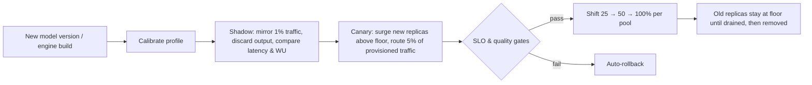

# 10 · Hardware & Model Lifecycle

## 1. New GPU generation

1. The new cluster/pool is provisioned (Cluster API). The Calibration Service produces a
   `PerformanceProfile` for each model on the new GPU class. The pool becomes **sellable**
   only after validation.
2. The Capacity Planner starts placing *new* reservations there. The nightly MILP
   rebalance proposes **gradual migrations** of existing `PoolAllocation`s. It shifts WU/s
   share (not whole tenants) in steps of ≤ 10% per hour, while watching SLO and cache-hit
   regressions.
3. **Customer entitlement does not change.** A reservation of 100 CUs is 100 CUs on
   either generation. The per-hardware profile absorbs the 2–3× difference. This addresses
   the blog's migration-ratio problem: the conversion happens per pool, using the
   calibrated cost model for that workload shape, not a single fleet-wide ratio.
4. Old pools shrink as allocations drain, and are retired or repurposed for PAYG.
5. Realised efficiency gains feed the semi-annual **CU re-rating** ([02 §7](02-capacity-unit-and-cost-model.md#7-hardware-efficiency-gains-the-blogs-dilemma)).

## 2. Hardware-pinned SKU

For customers who need a specific GPU class (numerical reproducibility, certification):
- The reservation carries `hardware: B200`. The planner never migrates it.
- It is priced at a premium to cover stranding risk. The term is capped at the hardware's
  planned service life.
- At end of life, the customer is offered conversion to a standard CU reservation at the
  published re-rated price.

## 3. Model version upgrades

The goal is zero throughput dip (blog: "model version upgrades without throughput dips").

- **Surge-first:** new replicas come up *above* the provisioned floor, using warm spares
  and PAYG backfill capacity. Old capacity is never removed first.
- **Customer-pinned model versions:** deployments may pin a version for its announced
  support window. The pool keeps both versions, and the planner accounts for both.
- **Engine upgrades** (for example, a new TRT-LLM release) follow the same path. A faster
  engine increases the profile's capacity, so the planner can release GPUs gradually.

## Blog problems addressed
P6, P9. See [traceability](01-requirements-and-traceability.md#2-traceability-matrix).
