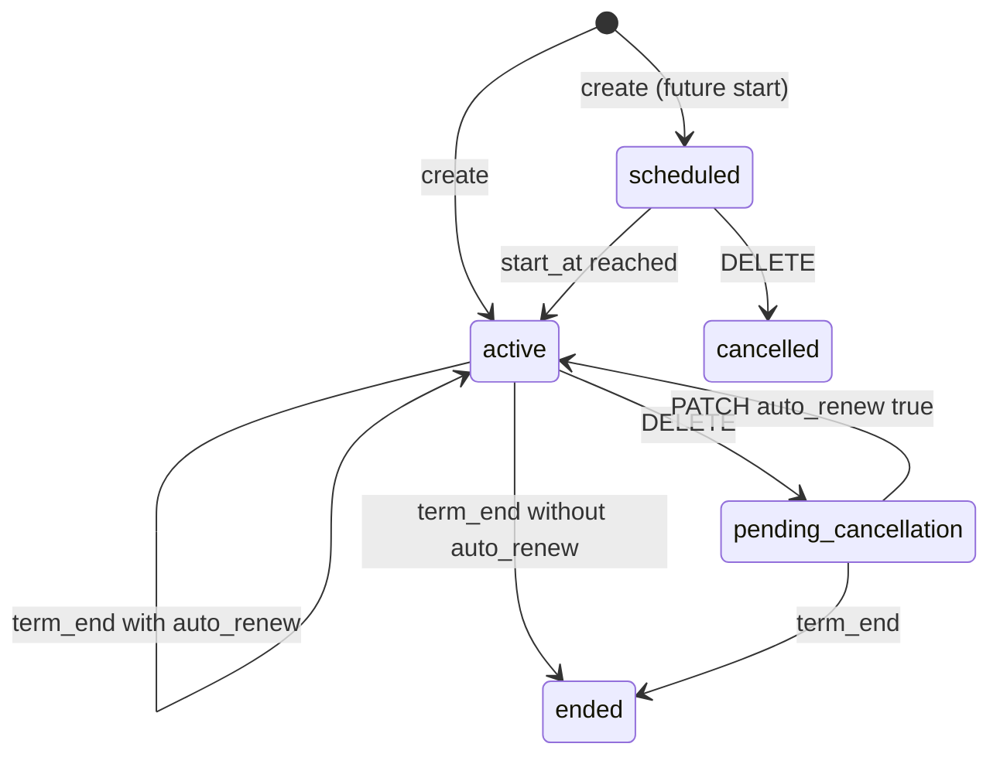
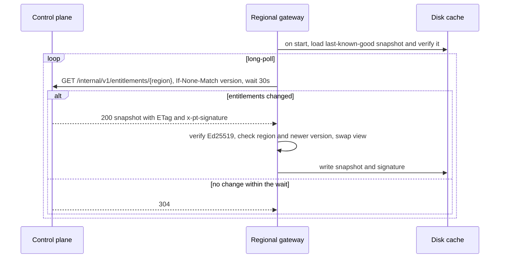

# 12 · Control-Plane API

> Decision records: [ADR-011](adr/ADR-011-single-pt-resource.md)

## 1. Scope

This is the customer API of the global control plane ([03 §2.1](03-system-architecture.md#21-global-control-plane)).
It lets a customer create, update, and delete Provisioned Throughput for a specific model.
It applies the commercial rules in [11 §4](11-roadmap-risks-open-questions.md#4-product-decisions).
Implementation: `crates/pt-control-plane`.

One **Provisioned Throughput** resource is a capacity reservation plus one data-plane
deployment (an endpoint per region and an inference API key). See [ADR-011](adr/ADR-011-single-pt-resource.md).

## 2. Endpoints

All requests use `Authorization: Bearer <tenant management key>`. Management keys are
separate from the inference keys that the gateway accepts.

| Method | Path | Success | Notes |
|--------|------|---------|-------|
| `GET` | `/v1/models` | 200 | Catalog: tiers offered and, per region, the longest context served |
| `POST` | `/v1/provisioned-throughput` | 201, or 200 on replay | Supports `Idempotency-Key`. Returns `Location`, `ETag`, and a one-time `api_key` |
| `GET` | `/v1/provisioned-throughput` | 200 | `?model=` filter. `?include_inactive=true` includes ended and cancelled reservations |
| `GET` | `/v1/provisioned-throughput/{id}` | 200 | Returns an `ETag` |
| `PATCH` | `/v1/provisioned-throughput/{id}` | 200 | Supports `If-Match`. Only the fields sent change |
| `DELETE` | `/v1/provisioned-throughput/{id}` | 202 mid-term, or 200 | Supports `If-Match` |

Create request:

```json
{
  "name": "acme-agents-prod",
  "model": "llama-4-maverick",
  "tier": "agentic",
  "regions": [{ "region": "eu-west", "cus": 6 }, { "region": "us-east", "cus": 4 }],
  "sku": "regional",
  "isolation": "shared",
  "term_months": 3,
  "start_at": "2026-10-01T00:00:00Z",
  "auto_renew": true,
  "shape": { "input_p95": 12000, "input_max": 64000, "output_p95": 800,
             "context_ceiling": 128000, "cache_hit_ratio": 0.6, "burst_factor": 3.0 },
  "boundary_policy": { "spillover": true, "burst": { "max_credit_seconds": 60 } }
}
```

`sku`, `isolation`, `start_at` (default: now), `auto_renew` (default: true), and
`boundary_policy` are optional.

Errors use the same shape as the gateway:
`{"error": {"type", "code", "message", "field"?}}`.

| Status | `code` | When |
|--------|--------|------|
| 401 | `invalid_api_key` | Missing or unknown management key |
| 404 | `not_found` | Unknown id, or the id belongs to another tenant |
| 409 | `capacity_unavailable` | Not enough CUs in a region |
| 409 | `name_taken`, `idempotency_key_reused`, `no_next_term`, `inactive`, `concurrent_modification` | State conflicts |
| 412 | `version_mismatch` | `If-Match` doesn't match the current version |
| 422 | `invalid_request` (with `field`), `invalid_json`, `not_offered`, `shape_unsupported` | Validation |

## 3. Rules

**Create**
- The model must exist, the tier must be offered for it, and every region must offer it.
  Each region needs at least 1 CU. `multi_region` needs at least two regions.
- The shape must satisfy `input_p95 ≤ input_max ≤ context_ceiling ≤` the model's
  maximum, and each region's pools must serve `context_ceiling`.
- Capacity is reserved in every region at once, or not at all.
- The term runs from `start_at` for 1, 3, or 6 calendar months (UTC). If `start_at` is
  in the future (up to 90 days), the reservation is `scheduled`.
- The inference API key is returned once. Only its SHA-256 is stored.
- Names are unique per tenant among live reservations.

**Update**

| Change | When it takes effect |
|--------|----------------------|
| CU increase in existing regions | Now, after a capacity check. Charged pro rata for the rest of the term |
| CU decrease, adding or removing regions | At the next renewal (`pending_changes`) |
| Tier | At the next renewal |
| Shape | Now, after checking that the regions can serve it |
| Boundary policy, auto-renew, name | Now |

Before the term starts, every change applies immediately. A request that mixes an increase
with a region change is scheduled as a whole. Send the increase on its own to apply it now.

**Delete**
- `scheduled` → `cancelled` immediately. Capacity is released and nothing is billed.
- `active` → `pending_cancellation` (202). The reservation keeps serving and billing until
  `term_end`, then ends. `PATCH {"auto_renew": true}` withdraws the cancellation.
- `pending_cancellation`, `ended`, `cancelled`: no change (idempotent).

**Lifecycle.** A background loop activates scheduled reservations, and renews or ends
reservations at `term_end`. Renewal applies `pending_changes`. If a scheduled region change
no longer fits the available capacity, the reservation renews unchanged and records a
`scheduled_change_failed` event. Missed renewals catch up.



## 4. Concurrency and idempotency

- Every resource has a `version`, returned as the `ETag`. `PATCH` and `DELETE` with
  `If-Match` fail with 412 if the version has changed. Without `If-Match`, a write that
  races another write fails with 409 `concurrent_modification`.
- A `POST` with an `Idempotency-Key` returns the original resource with status 200 when
  replayed with the same body. It returns 409 when the same key is sent with a different body.
- Capacity changes are undone if the resource write fails, so capacity is never reserved
  for a change that wasn't saved.

## 5. Storage

`Store` and `CapacityPlanner` are traits. The in-memory implementations back tests and
local runs. The CockroachDB schema is in
`crates/pt-control-plane/migrations/0001_provisioned_throughput.sql`. It has a partial
unique index for live names, a lifecycle index on `(state, term_end)`, an append-only
events table, and idempotency keys that expire after 7 days.

## 6. Entitlement snapshots

This is the Entitlement Distributor from [03 §2.1](03-system-architecture.md#21-global-control-plane),
and it follows [ADR-007](adr/ADR-007-regional-static-stability.md). The shared format is in
`crates/pt-entitlement` and the gateway side is `crates/pt-gateway/src/sync.rs`.



- **Content.** The snapshot has every `active` or `pending_cancellation` resource with a
  share in the region: the region's CUs, tier, shape, the pool's profile name, and each
  deployment's API-key SHA-256 and boundary policy. Scheduled, ended, and cancelled
  resources are left out, so keys start working at `term_start` and stop at `term_end`.
- **Versioning.** Every committed change (API or lifecycle) bumps a version. The version
  starts from the clock in milliseconds, so it keeps increasing across restarts. The
  version is read before the data, so a change made during generation is never labelled
  as already seen. Gateways apply only newer versions for their own region.
- **Trust.** The control plane signs the exact body with Ed25519, and gateways hold only
  the public key. Pull tokens are per region, and a token for another region gets 403.
- **Gateway apply.** A new view is swapped in atomically. Each reservation's limiter is
  reconfigured in place, so the bucket level, debt, burst credit, and in-flight
  settlements carry over. Deployments keep their output estimators. Reservations whose
  profile the gateway doesn't know are skipped and logged.
- **Static stability.** A gateway serves its cached snapshot through control-plane
  outages and restarts. `GET /internal/v1/entitlements` on the gateway reports the
  version and `generated_at`, so staleness can be alerted on.
- **Latency.** A change reaches a connected gateway in one long-poll round trip.
  Measured locally, a create was served in under 0.3 s (target N3: under 60 s).

## 7. Not yet built

- SQL store (CockroachDB) and a remote Capacity Planner client. The in-memory planner
  counts CUs per region and model, regardless of tier.
- Rotating the snapshot signing key. Gateways trust one public key, so rotation needs
  support for more than one key.
- Rotating inference keys, and more than one deployment per reservation.
- Invoicing. Events record amounts, but nothing turns them into invoices yet.

## Blog problems addressed
P4 (customer-facing unit), P5 (tier), P6 (term, renewal, re-rating at renewal), P12 (boundary policy). See [traceability](01-requirements-and-traceability.md#2-traceability-matrix).
