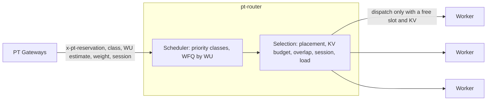

# 13 · Tenant-Aware Routing

> Decision records: [ADR-013](adr/ADR-013-tenant-scheduling-tier.md), [ADR-004](adr/ADR-004-three-level-fairness.md), [ADR-015](adr/ADR-015-failover-payg-preemption.md)

## 1. What it does

This is level 2 of the three-level fairness in [05 §1](05-isolation-and-scheduling.md#1-principle).
The gateway decides *whether* a request may run (entitlement). The router decides *which
request runs next*, and *on which worker*:

- **Order.** Strict priority `provisioned > burst > spillover > payg`. Within a class,
  weighted fair queuing by WU across reservations, weighted by each reservation's
  allocation. A small guard keeps PAYG from starving.
- **Placement.** Pull-based dispatch: a request goes only to a worker with a free slot and
  enough KV blocks, so engine queues stay shallow and ordering stays in the router. Among
  those workers, dedicated-worker placement and per-reservation KV budgets filter, then
  prefix-cache overlap, session affinity, and load choose.

The implementation is `crates/pt-router`. It runs today as a tier between gateways and
workers.



## 2. Algorithms

**Scheduler** (`scheduler.rs`)
- Self-clocked fair queuing per class. A request from flow *f* gets
  `finish = max(V, last_finish_f) + wu ÷ weight_f`. Each dispatch advances `V` to the
  dispatched request's finish tag. An idle flow can't bank credit.
- The weight comes from the reservation's `PoolAllocation.wuPerSec`. Without one, it's
  the gateway's `x-pt-weight` (its local share of the entitlement).
- Requests within a flow stay FIFO. The dispatcher may skip a flow whose head can't be
  placed (for example, its KV budget is full), so one blocked reservation doesn't hold up
  others. The scan is bounded to 64 heads per round.
- PAYG goes first after `payg_guard_every` dispatches without one, if any is waiting.

**Selection** (`workers.rs`)

| Step | Rule |
|------|------|
| Eligibility | A reservation's dedicated workers serve only it, plus PAYG and spillover backfill (ADR-006). A reservation with dedicated workers uses only those for provisioned and burst traffic |
| Feasibility | A request larger than every eligible worker's KV capacity is rejected at once (400 `router_request_too_large`), not queued forever |
| Credit | `slots_used < slots` and `kv_used + blocks ≤ kv_blocks` |
| KV budget | `held + blocks ≤ kv_share × kv_blocks × 1.2` per worker, unless the reservation holds nothing there (one oversized request may run alone) |
| Backfill cap | PAYG and spillover hold at most `backfill_ratio` (default 0.5) of a floor worker's slots and KV blocks. Hot spares aren't capped ([ADR-026](adr/ADR-026-backfill-ratio.md)) |
| Failover fence | While a failover is active, PAYG isn't placed on hot spares. Spillover and provisioned traffic can use them |
| Score | `load × (slot and KV utilisation) − overlap × (prefix tokens held ÷ prompt tokens) − session × (same session's worker) + spare × (PAYG or spillover on the floor, or provisioned or burst on a hot spare)`. Lowest cost wins |

The KV footprint is `(prompt tokens + max_tokens) ÷ block_size`. Prefix overlap comes from
the router's own index of which worker served which message prefixes, like Dynamo's
approximate KV routing mode.

**Capacity accounting** (`http.rs`). A dispatched request owns a release guard, so
capacity is freed on every exit: completion, worker error, client disconnect while
queued or streaming, a queue timeout that races a dispatch, and preemption.

**Hot spares and failover preemption** (`dispatch.rs`, `workers.rs`, ADR-015). Workers
marked `hot_spare` are the pool's loaded failure-domain headroom (docs/06 §3). In normal
times PAYG prefers them and provisioned traffic prefers the floor, so spares earn money
without delaying provisioned work.
- **Failover signal.** The gateway marks provisioned requests with `x-pt-failover` while
  their reservation uses a failover entitlement (docs/07 §4). Each marked request keeps
  the router's failover state active for `failover_hold_ms` (30 s).
- **Fence.** While failover is active, new PAYG stays off hot spares.
- **Preempt.** While failover is active, a provisioned queue head that has waited
  `preempt_grace_ms` (250 ms) with every eligible worker busy names one running PAYG
  request to abort. The victim must free enough room for the head. The router prefers one
  on a hot spare, and then the youngest, so the least generated work is lost. A victim is
  named once, and its capacity counts as already freed, so one waiting request never
  aborts more than it needs. A 50 ms ticker re-runs dispatch, so the grace period applies
  even when no request arrives or finishes.
- **What the PAYG client sees.** 503 `preempted` with `Retry-After: 1` if its response
  hadn't started. If it was streaming, it gets a final SSE event
  `{"error":{"code":"preempted"}}`. The router drops the upstream response, which cancels
  the work on the worker, and the release guard frees the capacity.
- Only `payg` is preempted. Spillover is a PT customer's overflow and is never aborted.
- `/v1/router/status` reports `failover_active` and `preempted`, and flags each worker's
  `hot_spare`.

## 3. Mapping onto Dynamo

Dynamo's KV router has a plugin registry: `RouterPlugins` with a request classifier and a
worker-selection policy, installed through `install_router_plugin_registry`. The policy is
assembled from these traits, each with `required_worker_inputs()`:

```rust
// From ai-dynamo/dynamo lib/kv-router/src/plugins/worker_selection.rs (main, Sept 2026).
pub trait WorkerFilter: Send {
    fn keep(&mut self, context: &WorkerSelectionContext<'_>, candidate: WorkerCandidate<'_>)
        -> Result<bool, WorkerSelectionPolicyError>;
}
pub trait WorkerScorer: Send {
    fn score(&mut self, context: &WorkerSelectionContext<'_>, candidates: WorkerCandidates<'_>,
             costs: &mut [f64]) -> Result<(), WorkerSelectionPolicyError>;
}
pub trait WorkerPicker: Send {
    fn pick(&mut self, context: &WorkerSelectionContext<'_>, input: WorkerInputView<'_>)
        -> Result<usize, WorkerSelectionPolicyError>;
}
```

| pt-router function | Dynamo home | Notes |
|--------------------|-------------|-------|
| Read `x-pt-class`, `x-pt-reservation` | Request classifier plugin | Attach class and reservation to the request context |
| Dedicated-worker eligibility | `WorkerFilter::keep` | Needs the `PoolAllocation` dedicated set (from etcd, docs/08 §2) |
| Per-reservation KV budget | `WorkerFilter::keep` | Needs per-worker, per-reservation KV held. Dynamo tracks blocks per worker, not per tenant, so PT keeps this accounting from KV events tagged with the request's reservation |
| Overlap, load, session scoring | `WorkerScorer::score` | Dynamo already scores overlap and load from its own cache and load inputs. PT adds the session term and a penalty near a reservation's KV budget |
| Priority classes, WFQ, pull-based dispatch | **No plugin point** | Selection plugins choose a worker for a request that's already been picked. Ordering *across* requests needs a queue in front |

A sketch of the adapter. It's **unverified**: it has never been compiled, the trait
signatures above are from Dynamo `main`, and the context and candidate field names are
assumptions to check.

```rust
struct PtPlacementFilter { allocations: Arc<RwLock<HashMap<String, Allocation>>>, kv: Arc<TenantKvTable> }
impl WorkerFilter for PtPlacementFilter {
    fn keep(&mut self, ctx: &WorkerSelectionContext<'_>, c: WorkerCandidate<'_>) -> Result<bool, _> {
        let reservation = ctx.annotation("pt-reservation");          // assumed accessor
        let payg = matches!(ctx.annotation("pt-class"), Some("payg" | "spillover"));
        // eligible_one: a single-worker form of pt_router::workers::eligible, still to be added.
        Ok(eligible_one(&self.allocations.read(), c.worker_id(), reservation, payg)
            && self.kv.within_budget(c.worker_id(), reservation, ctx.request_blocks()))
    }
}
```

## 4. Deployment path

1. **Now: a tier in front of Dynamo.** Each Dynamo frontend or pool is a pt-router
   "worker", with slots and KV blocks sized from its capacity. pt-router provides
   ordering and cross-tenant fairness. Dynamo provides KV-aware selection inside the pool.
   This needs no Dynamo changes.
2. **Next: selection plugins.** Move placement and KV budgets into Dynamo's
   `WorkerFilter`/`WorkerScorer`, driven by `PoolAllocation`s from etcd. Take credits from
   Dynamo's worker load inputs instead of static configuration.
3. **Later: a queue policy upstream.** Propose a scheduling-order hook to Dynamo, so
   priority classes and WFQ can live in its router and the separate tier can go.

## 5. Not built

- Iteration-level preemption inside the engine (docs/05 §4). The router preempts only
  by aborting whole PAYG requests, and only during a failover.
- Rendering hot spares as separately addressable workers. The capacity controller sizes
  `headroom.hotSpares` into the pool's replicas, but the router's `hot_spare` flags come
  from `config/router.toml`. In the tier deployment, each hot spare needs its own frontend
  (or DGD service) registered as a router worker. With selection plugins, the fence
  becomes a `WorkerFilter` on a spare label.
- The engine KV-budget adapter (docs/05 §4). The router enforces budgets at placement
  only.
- Credits and prefix state from real Dynamo metrics and KV events. Workers and
  allocations come from `config/router.toml`.
- Multiple router replicas. Each replica has its own queues and capacity view, so run
  one per pool until state is shared.

## Blog problems addressed
P13–P17 (noisy neighbours, isolation, priority, and provisioned traffic preempting PAYG), P9 (hot spares during region failover). See [traceability](01-requirements-and-traceability.md#2-traceability-matrix).
